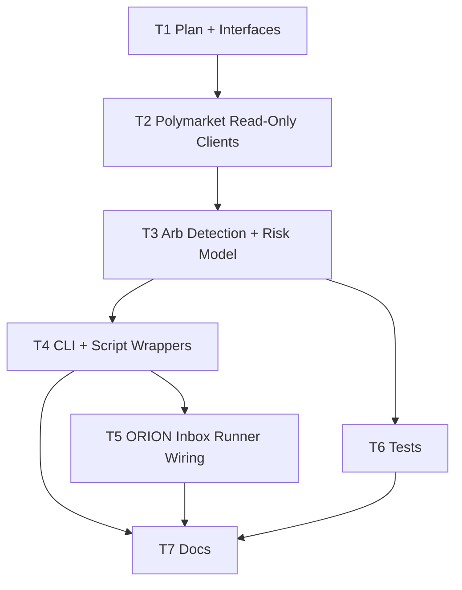

# Polymarket Arb Bot Plan (ORION)

Goal: add a safe-by-default arb bot that plugs into ORION workflows, can scan for arb opportunities, and can be extended to live trading only with explicit, gated enablement.

## Dependency Graph

## T1: Define Scope + Interfaces (T1)
- depends_on: []
- description: Define read-only scanning scope (no live trading), data model for opportunities, and CLI surface.
- success_criteria:
  - A plan is present and passes `make plan-graph`.
  - Scanner outputs a deterministic JSON summary for the same inputs.

## T2: Implement Polymarket Read-Only Clients (T2)
- depends_on: [T1]
- description: Add small HTTP clients for Gamma (market discovery) and CLOB (order book) with timeouts, user-agent, and basic retry/backoff.
- success_criteria:
  - `python3 scripts/arb_bot.py scan --max-markets 1` completes without crashing.
  - Handles 403s by always sending a user-agent header.

## T3: Arb Detection + Risk Guardrails (T3)
- depends_on: [T2]
- description: Add internal (within-market) arb detection for YES/NO pairs: buy both at best ask when `ask_yes + ask_no < 1 - fees - min_edge`.
- success_criteria:
  - Opportunities are reported with edge in bps and an estimated profit per $1 payout.
  - Live trading remains disabled by default and cannot be triggered from inbox runner.

## T4: CLI + Script Wrappers (T4)
- depends_on: [T3]
- description: Add `scripts/arb_bot.py` CLI and a `scripts/arb_scan.sh` wrapper for safe read-only operation.
- success_criteria:
  - `./scripts/arb_scan.sh --max-markets 5` returns a machine-readable JSON blob.

## T5: ORION Inbox Runner Wiring (T5)
- depends_on: [T4]
- description: Add `arb_scan.sh` to `scripts/run_inbox_packets.py` allowlist (read-only only).
- success_criteria:
  - A Task Packet with `read-only`, `Notify: telegram|discord`, and `Commands to run: arb_scan.sh ...` executes via `scripts/run_inbox_packets.py`.

## T6: Regression Tests (T6)
- depends_on: [T3]
- description: Add Python unit tests for the arb math / edge calculation and JSON output normalization.
- success_criteria:
  - `npm test` passes.

## T7: Docs (T7)
- depends_on: [T4, T5, T6]
- description: Document setup, usage, and the “no auto-trade” default; include explicit stop gates for credential material and any live trading.
- success_criteria:
  - `docs/ARB_BOT.md` exists and matches repo safety posture (`SECURITY.md`, `KEEP.md`).

