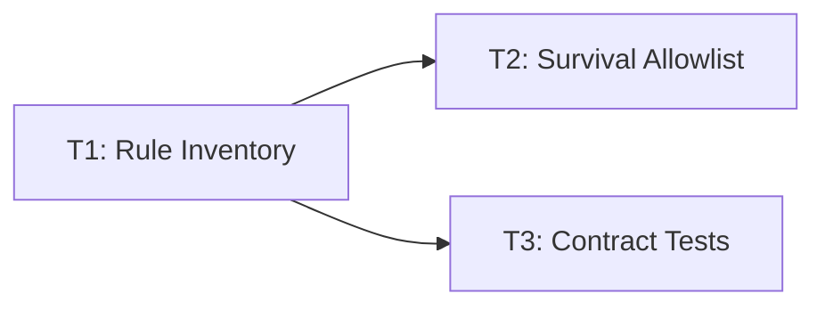

# Instruction Density Baseline for Early Tasks

This document captures the safe baseline before any instruction-pruning edits.
Scope is limited to inventory + survival-rule mapping + contract tests.

## Task Plan

| task_id | description | depends_on |
| --- | --- | --- |
| T1 | Inventory duplicated rules across AGENTS, shared routing, ORION role, and generated ORION SOUL. | [] |
| T2 | Define a survival duplicate allowlist (small set of rules intentionally repeated). | [T1] |
| T3 | Add contract tests that fail if survival rules disappear from canonical files or SOUL injection head. | [T1] |

## Dependency Graph

## Rule Inventory

## T1 Baseline Inventory

depends_on: []

Inventory duplicated safety-critical rules across `AGENTS.md`, shared routing, `src/agents/ORION.md`, and the generated ORION SOUL artifact before any pruning edits.

## T2 Survival Duplicate Allowlist

depends_on: [T1]

Define the small set of intentionally duplicated rules that must survive compaction because they are truncation-sensitive or safety-critical.

## T3 Contract Test Guardrails

depends_on: [T1]

Keep contract tests in place so pruning work cannot silently remove the surviving rules from canonical files or the generated ORION SOUL header.

| rule_id | rule statement | evidence | recommended source of truth | keep duplicated? |
| --- | --- | --- | --- | --- |
| R1 | Cron/scheduling reminders delegate to ATLAS using Task Packet; never claim already configured. | `AGENTS.md:13`, `AGENTS.md:15`, `src/core/shared/ROUTING.md:27`, `src/agents/ORION.md:77`, `agents/ORION/SOUL.md:278` | `src/core/shared/ROUTING.md` | yes |
| R2 | Never claim operational changes complete without execute+verify or specialist `Result:`. | `AGENTS.md:76`, `src/core/shared/ROUTING.md:22`, `src/agents/ORION.md:16`, `agents/ORION/SOUL.md:214` | `src/core/shared/ROUTING.md` | yes |
| R3 | Crisis language requires safety-first guidance and explicit EMBER handoff. | `AGENTS.md:79`, `src/core/shared/ROUTING.md:33`, `src/agents/ORION.md:82`, `src/agents/ORION.md:83`, `agents/ORION/SOUL.md:283`, `agents/ORION/SOUL.md:284` | `src/core/shared/ROUTING.md` | yes |
| R4 | Destructive reset requires explicit confirmation and a reversible first step. | `AGENTS.md:78`, `src/agents/ORION.md:86`, `src/agents/ORION.md:87`, `agents/ORION/SOUL.md:287`, `agents/ORION/SOUL.md:288` | `AGENTS.md` | yes |
| R5 | Force explicit mode gate: ask `explore` vs `execute` and require one-word choice. | `AGENTS.md:80`, `src/agents/ORION.md:73`, `agents/ORION/SOUL.md:274` | `src/agents/ORION.md` | yes |
| R6 | `sessions_spawn` announce prompt must return exactly `ANNOUNCE_SKIP`. | `AGENTS.md:156`, `AGENTS.md:168`, `src/agents/ORION.md:97`, `agents/ORION/SOUL.md:298` | `AGENTS.md` | yes |

## Survival Duplicate Allowlist

Keep R1-R6 intentionally duplicated across top-level + role/routing layers because they are safety-critical and truncation-sensitive.

## First Collapse Candidates After Baseline Contracts

1. Telegram exclusivity repeats in AGENTS, role, and generated SOUL.
2. Discord exclusivity/safety repeats in role and generated SOUL.
3. Transcript/speaker-tag ban repeats in role and generated SOUL.
4. `Ping` -> `ORION_OK` repeats in role and generated SOUL.
5. Internal-monologue ban repeats in role and generated SOUL.

## T4 Execution Log

depends_on: [T2, T3]

- Applied in `src/agents/ORION.md`:
  - Removed Telegram-only and Discord-only exclusivity repeats.
  - Removed duplicated transcript-tag guidance line.
  - Removed `Ping` -> `ORION_OK` low-priority behavior line.
  - Shortened the ATLAS sub-agent canned explanation.
- Validation:
  - `python3 -m unittest tests.test_orion_instruction_contracts tests.test_soul_size_budget` -> `OK`
- Prompt budget impact (composed ORION SOUL):
  - Before T4: `17026` chars
  - After T4: `16489` chars
  - Net reduction: `537` chars

## T5 Execution Log

depends_on: [T4]

- Added duplicate-rule allowlist policy:
  - `src/core/shared/instruction_duplicate_allowlist.json`
- Added CI guardrail test:
  - `tests/test_instruction_duplicate_allowlist.py`
- Validation:
  - `python3 -m unittest tests.test_instruction_duplicate_allowlist tests.test_orion_instruction_contracts tests.test_soul_size_budget` -> `OK`

## T6 Execution Log

depends_on: [T5]

- Applied an additional low-risk compaction cluster in `src/agents/ORION.md`:
  - Removed duplicated hierarchy terminology text.
  - Removed repeated ops chain-of-command line from the email subsection.
- Validation:
  - `python3 -m unittest tests.test_instruction_duplicate_allowlist tests.test_orion_instruction_contracts tests.test_soul_size_budget` -> `OK`
- Prompt budget impact (composed ORION SOUL):
  - Before T6: `16489` chars
  - After T6: `16251` chars
  - Net reduction: `238` chars

- Applied AGENTS few-shot compaction micro-cluster in `AGENTS.md`:
  - Cron few-shot now points to the existing hard template instead of repeating full shape + anti-shape.
  - Spending few-shot removed verbose sample questions while preserving intake/delegation behavior.
- Validation:
  - `python3 -m unittest tests.test_instruction_duplicate_allowlist tests.test_orion_instruction_contracts tests.test_soul_size_budget` -> `OK`

- Applied AGENTS hard-template micro-cluster in `AGENTS.md`:
  - Collapsed nested cron template bullets into one concise requirement line.
  - Removed duplicated crisis hard-template block (behavior remains in Minimal rules + Few-Shot).
- Validation:
  - `python3 -m unittest tests.test_instruction_duplicate_allowlist tests.test_orion_instruction_contracts tests.test_soul_size_budget` -> `OK`
