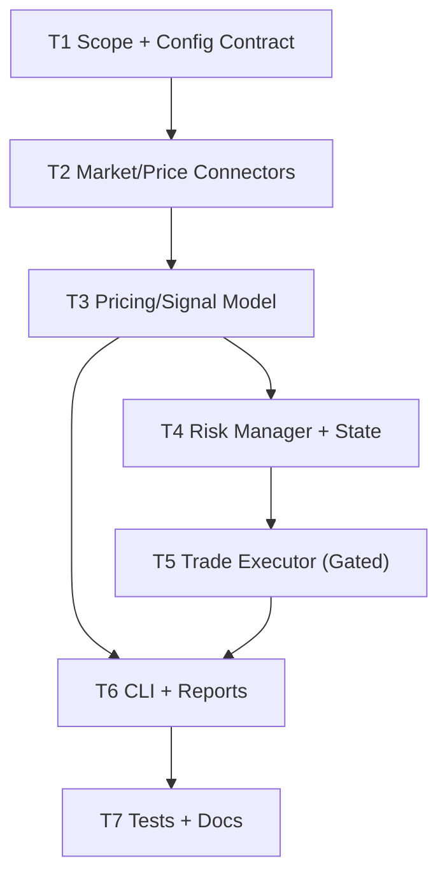

# Kalshi Crypto Reference Arb Bot Plan

Objective: implement a Kalshi trading bot that:
- scans Kalshi crypto strike markets (e.g., BTC/ETH “above/below” style)
- estimates fair probability from Coinbase+Kraken reference spot plus a configurable volatility model
- places Kalshi orders automatically **only** when explicitly enabled and within risk limits

## Dependency Graph

## T1: Scope + Config Contract (T1)
- depends_on: []
- description: Define supported Kalshi market types (initially binary `strike_type` in `{greater, less}` with `floor_strike`) and CLI/env config contract.
- success_criteria:
  - Plan passes `make plan-graph`.
  - Stop-gates for write actions are explicit in docs.

## T2: Market/Price Connectors (T2)
- depends_on: [T1]
- description: Implement:
  - Kalshi public market data fetch (unauth) and authenticated request wrapper (auth via RSA-PSS, timestamp+method+path)
  - Coinbase + Kraken spot price fetch for BTC/USD and ETH/USD
- success_criteria:
  - `python3 scripts/kalshi_ref_arb.py scan --limit 5` runs without credentials.

## T3: Pricing/Signal Model (T3)
- depends_on: [T2]
- description: Implement a simple lognormal/volatility-based probability estimate for `P(S_T > K)` and signal generation vs Kalshi best bid/ask.
- success_criteria:
  - Signals include fair prob, best bid/ask, edge bps, and recommended side/action.

## T4: Risk Manager + State (T4)
- depends_on: [T3]
- description: Implement guardrails:
  - kill-switch file
  - max orders per run
  - max contracts per order
  - max notional per run
  - max exposure per market
  - state persisted under `tmp/` only
- success_criteria:
  - Risk policy is enforced in `trade` mode and visible in JSON output.

## T5: Trade Executor (Gated) (T5)
- depends_on: [T4]
- description: Add Kalshi order placement with explicit gating (`--allow-write` + credentials) and conservative defaults.
- success_criteria:
  - Dry-run works without credentials and never sends writes.
  - Live mode refuses without `--allow-write`.

## T6: CLI + Reports (T6)
- depends_on: [T3, T5]
- description: Add `scripts/kalshi_ref_arb.py` with subcommands:
  - `scan` (read-only JSON)
  - `trade` (dry-run by default; live only when enabled)
- success_criteria:
  - Outputs stable JSON suitable for ORION to summarize.

## T7: Tests + Docs (T7)
- depends_on: [T6]
- description: Add unit tests for probability math + signal logic. Document configuration and stop gates.
- success_criteria:
  - `npm test` passes.
  - `docs/KALSHI_REF_ARB.md` exists.

